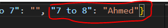
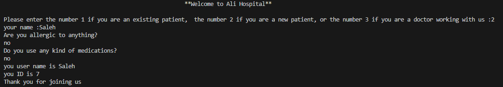
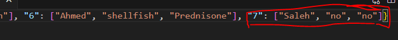
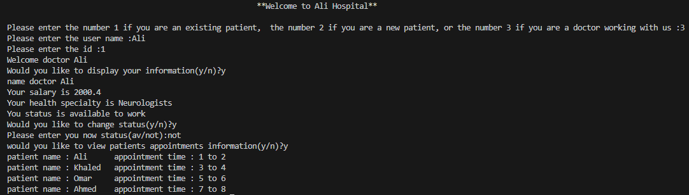
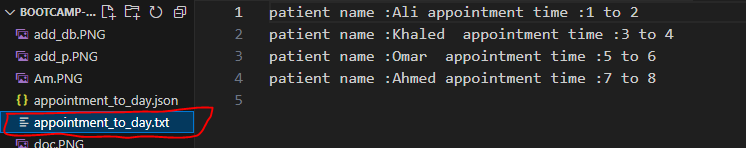

# Ali Hospital System

### introduction
This is a simple Python code for a hospital management system. It allows patients to schedule appointments, verify if they have an appointment, if they do not have account they can create one. It also allows doctors to view their information, change their status, and view patients' appointments information.

#### To use the system:

1. Run the code in a Python interpreter.
2. Enter your user type:
    -  1 for existing patient
    -  2 for new patient
    -  3 for doctor
3. Enter your username and ID.
4. Follow the prompts on the screen.

#### Example:
**how to book an appointment? **

**The new appointment has been added to our database: **

**how to add now patient? ** 

**The new patient has been added to our database: **

**The doctor: **

**The code creates a text file and adds patient appointment information to it: **

##### Notes:

- The system uses two JSON files to store patient and appointment data: our_patient.json and appointment_to_day.json.
- The system uses a dictionary to store doctor data: Doctors.
- The system uses a function called get_the_names() to get a list of all the patient names in the our_patient dictionary.
- The system uses a function called find_key_by_value() to find the key of a value in a dictionary.

##### project requirements:
- At least 3 different data types: strings (e.g., name, schedule), integers (e.g., id, num_su), and floats (e.g., salary)
- Lists or dictionaries or tuples or sets: dictionaries (e.g., our_patient, Doctors)
- Loops: for loop (e.g., for i in range(0,len(appointment_to_day)))
- Functions that return an output: get_the_names(), find_key_by_value()
- Conditions: if statements (e.g., if user == "1":, if schedule=="y"\:)
- A lambda function: load_patient_db = lambda :dict(json.load(open('our_patient.json', 'r')))

