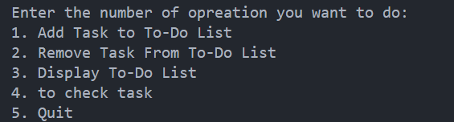
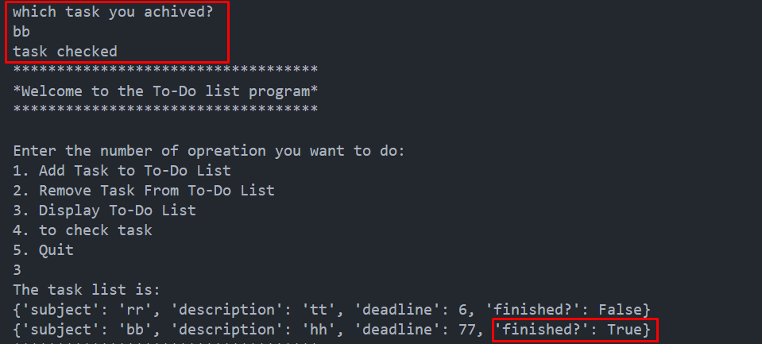

# What is a To-Do List?

A to-do list is an effective tool for task management in various formats: pen-and-paper or digital apps. It helps track and prioritize tasks, preventing forgetfulness about important activities or deadlines.

## Example of a to-do list

## Benefits of Using a To-Do List

- **Improved Productivity**: To-do lists help you stay organized, prioritize tasks, and increase your productivity by providing a clear plan of action.

- **Time Management**: To-do lists assist in effective time management, ensuring you allocate time to high-priority tasks.

- **Goal Achievement**: By breaking down larger goals into manageable tasks, to-do lists can aid in achieving long-term objectives.

## The Program 

- **Menu**: There is 4 menu options available 

1. Adding The task to the list

2. Removing The task from the list

3. Display the To-Do List

4. Checking the finished Task 
